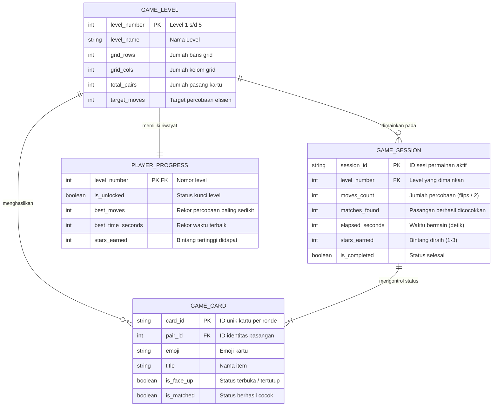

# ⚡ Memory Match Neo - Flutter Speed Code Challenge

Aplikasi mobile game **Memory Match Card** yang dikembangkan menggunakan **Flutter** dengan pendekatan desain **Neo-Brutalism** untuk kegiatan **Flutter Speed Code Challenge**.

---

## 🎨 Karakteristik Gaya Desain: Neo-Brutalism

Aplikasi ini mengadopsi prinsip desain **Neo-Brutalism** secara menyeluruh:
- **Tebal Border:** `3px - 4px` solid border hitam (`#121212`) pada seluruh elemen (kartu, tombol, banner, badge).
- **Hard Drop Shadow:** Bayangan tegas `offset: (4, 4)` tanpa blur (`blurRadius: 0`).
- **Palet Warna Pop Kontras Tinggi:** Warm Cream (`#FFFBEB`), Electric Yellow (`#FFE600`), Hot Pink (`#FF5C8D`), Electric Cyan (`#00E5FF`), Neon Green (`#26DE81`), dan Royal Purple.
- **Tipografi Bold Modern:** Font *Space Grotesk* dari Google Fonts dengan bobot font tebal dan label uppercase.
- **Efek Taktil:** Tombol dengan animasi tekanan nyata (*press-down translation*).
- **Animasi Flip 3D:** Kartu berputar pada sumbu Y (3D perspective transform) saat dibuka maupun ditutup.

---

## 🚀 Fitur Utama

1. **Menampilkan Kartu Tertutup:** Seluruh kartu tertutup di awal ronde dengan motif Neo-Brutalist dan ikon tanda tanya.
2. **Membuka Kartu Saat Dipilih (3D Flip Animation):** Kartu berputar dinamis secara 3D saat disentuh untuk menampilkan emoji dan label.
3. **Mencocokkan Pasangan Kartu:** Logika membandingkan 2 kartu yang terbuka. Jika cocok, kartu terkunci dengan status sukses; jika tidak cocok, kartu tertutup kembali otomatis setelah jeda waktu singkat.
4. **Menghitung Percobaan (Moves Counter):** Setiap kali pemain membuka sepasang kartu, counter percobaan bertambah secara real-time.
5. **Timer Permainan:** Menghitung waktu bermain pemain dari detik ke detik.
6. **5 Level Tantangan:**
   - **Level 1 (Warm Up):** Grid `2 × 2` (4 kartu / 2 pasang) — Tema Buah 🍎🍌
   - **Level 2 (Rookie):** Grid `3 × 2` (6 kartu / 3 pasang) — Tema Hewan 🐱🐶🦊
   - **Level 3 (Challenger):** Grid `4 × 2` (8 kartu / 4 pasang) — Tema Kendaraan 🚀🏎️✈️🚁
   - **Level 4 (Master):** Grid `4 × 3` (12 kartu / 6 pasang) — Tema Hobi & Olahraga ⚽🎮🏀🎸🛹🥊
   - **Level 5 (Grandmaster):** Grid `4 × 4` (16 kartu / 8 pasang) — Tema Elemen ⚡🔥💎🌈🌟🔮🍀🎯
7. **Sistem Bintang & Progres Level:**
   - Bintang 1 s/d 3 dihitung berdasarkan efisiensi jumlah percobaan terhadap target tiap level.
   - Menyelesaikan level otomatis membuka (*unlock*) level berikutnya.
   - Rekor skor terbaik (*best moves*) tersimpan untuk setiap level.
8. **Dialog Kemenangan Interaktif (Victory Modal):** Menampilkan perolehan bintang, rincian percobaan, waktu tempuh, serta tombol navigasi level berikutnya.

---

## 📊 Entity Relationship Diagram (ERD)



---

## 📂 Struktur Direktori Proyek

```
lib/
├── main.dart                      # Entry point & orientasi layar
├── theme/
│   └── neo_brutalism_theme.dart   # Warna pop, border 3px, hard shadows, tipografi
├── models/
│   ├── game_card.dart             # Model data kartu game
│   ├── game_level.dart            # Konfigurasi 5 level dan data kartu
│   └── player_progress.dart       # Model pencatat rekor & unlock level
├── services/
│   └── game_storage.dart          # State management progress & high score
├── widgets/
│   ├── neo_card.dart              # Widget kartu 3D flip interaktif
│   ├── neo_button.dart            # Tombol tactile neo-brutalist dengan press down
│   ├── neo_badge.dart             # Indikator statistik (Moves, Matched, Timer)
│   └── victory_dialog.dart        # Modal kemenangan saat menyelesaikan level
└── screens/
    ├── home_screen.dart           # Menu utama & daftar pemilihan 5 level
    └── game_screen.dart           # Papan permainan & state machine gameplay
```

---

## 💻 Cara Menjalankan Proyek

1. **Clone repository ini:**
   ```bash
   git clone <URL_REPOSITORY_ANDA>
   cd PTSF
   ```

2. **Unduh dependensi Flutter:**
   ```bash
   flutter pub get
   ```

3. **Jalankan aplikasi:**
   ```bash
   flutter run
   ```

4. **Menjalankan pengujian (Tests):**
   ```bash
   flutter test
   ```
