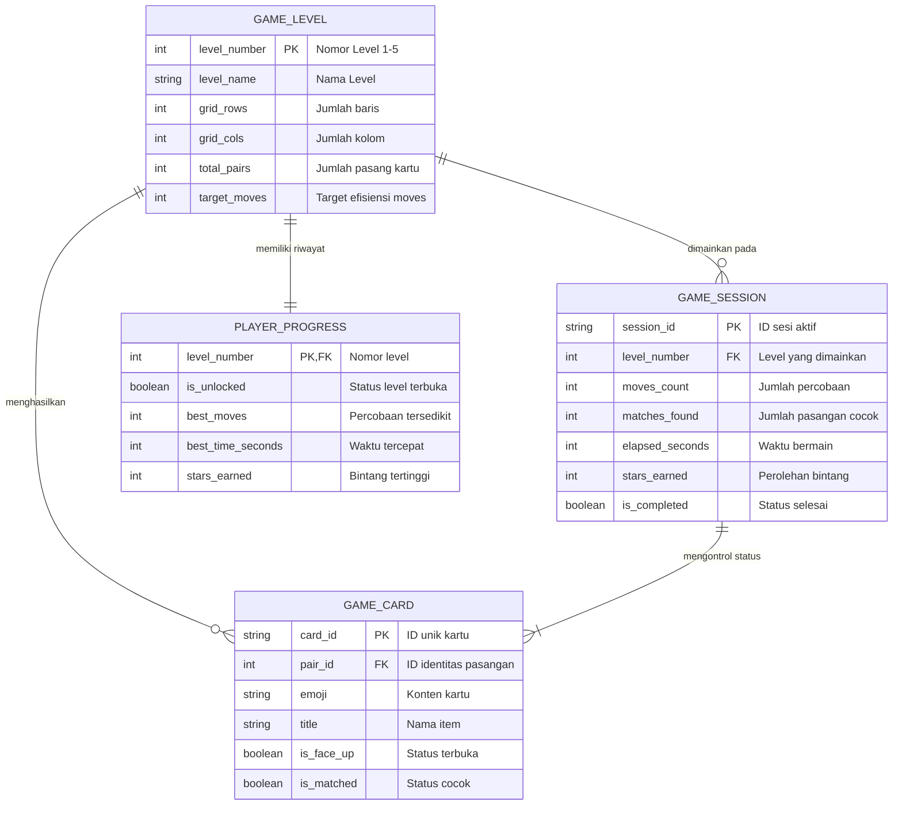

# Memory Match Card - Neo-Brutalism

Aplikasi mobile game Memory Match Card berbasis Flutter yang dibuat untuk kegiatan Flutter Speed Code Challenge. Aplikasi ini menerapkan gaya desain Neo-Brutalism dengan mekanisme permainan mencocokkan pasangan kartu tertutup melalui 5 tingkat kesulitan.

---

## Karakteristik Desain (Neo-Brutalism)

Aplikasi dibangun dengan prinsip desain Neo-Brutalism yang konsisten pada seluruh komponen:
- Border hitam tegas berukuran 3 hingga 3.5 px di semua kartu, tombol, container, dan badge.
- Hard shadow tanpa blur (`blurRadius: 0`) dengan offset `(4, 4)` untuk memberikan efek kedalaman datar yang kuat.
- Palet warna kontras tinggi, menggunakan perpaduan Warm Cream sebagai warna dasar dengan warna aksen seperti Electric Yellow, Hot Pink, Cyan, Lime Green, dan Oranye.
- Sudut komponen sedikit melengkung (radius 8-14 px) untuk menjaga kesan geometris yang rapi.
- Tipografi Space Grotesk dengan ketebalan bold pada teks judul dan tombol.
- Efek interaksi tombol taktil yang bergeser ke bawah saat ditekan (press-down effect).

---

## Fitur Aplikasi

1. **Kartu Tertutup**: Semua kartu tertutup di awal permainan dengan motif tanda tanya dan warna khas Neo-Brutalist.
2. **Animasi Buka Kartu (3D Flip)**: Kartu berputar secara 3D pada sumbu horizontal saat dipilih oleh pemain.
3. **Pencocokan Pasangan Kartu**: Logika memeriksa kesamaan identitas kartu. Jika cocok, kartu akan tetap terbuka dan terkunci; jika tidak cocok, kartu akan tertutup kembali secara otomatis setelah jeda waktu tertentu.
4. **Penghitung Percobaan (Moves Counter)**: Menghitung setiap percobaan pemain membuka dua kartu.
5. **Timer Permainan**: Menghitung durasi permainan secara realtime dari awal hingga level selesai.
6. **5 Level Permainan**:
   - Level 1: Grid 2x2 (4 kartu / 2 pasang) - Tema Buah
   - Level 2: Grid 3x2 (6 kartu / 3 pasang) - Tema Hewan
   - Level 3: Grid 4x2 (8 kartu / 4 pasang) - Tema Transportasi
   - Level 4: Grid 4x3 (12 kartu / 6 pasang) - Tema Hobi & Olahraga
   - Level 5: Grid 4x4 (16 kartu / 8 pasang) - Tema Elemen & Alam
7. **Sistem Bintang dan Unlock Level**:
   - Pemain mendapatkan 1 sampai 3 bintang berdasarkan jumlah percobaan terhadap target tiap level.
   - Menyelesaikan suatu level akan otomatis membuka level berikutnya.
   - Skor percobaan terbaik disimpan pada masing-masing level.
8. **Dialog Kemenangan**: Menampilkan ringkasan bintang, jumlah percobaan, waktu tempuh, serta opsi untuk lanjut ke level berikutnya atau mengulang level.

---

## Entity Relationship Diagram (ERD)



---

## Struktur Direktori

```
lib/
├── main.dart                      # Inisialisasi aplikasi dan orientasi layar
├── theme/
│   └── neo_brutalism_theme.dart   # Konstanta warna, dekorasi border, dan tipografi
├── models/
│   ├── game_card.dart             # Model objek kartu
│   ├── game_level.dart            # Data konfigurasi 5 level
│   └── player_progress.dart       # Model penyimpanan rekor pemain
├── services/
│   └── game_storage.dart          # Pengelolaan state level dan skor
├── widgets/
│   ├── neo_card.dart              # Komponen kartu dengan animasi flip 3D
│   ├── neo_button.dart            # Komponen tombol dengan efek tekan
│   ├── neo_badge.dart             # Komponen tampilan indikator statistik
│   └── victory_dialog.dart        # Dialog popup saat level selesai
└── screens/
    ├── home_screen.dart           # Halaman menu dan pemilihan level
    └── game_screen.dart           # Halaman arena bermain kartu
```

---

## Cara Menjalankan Aplikasi

1. Clone repositori ini:
   ```bash
   git clone https://github.com/SukaMCD/PTSF.git
   cd PTSF
   ```

2. Unduh paket dependensi:
   ```bash
   flutter pub get
   ```

3. Jalankan aplikasi:
   - Untuk Web / Browser:
     ```bash
     flutter run -d web-server --web-port=8080 --web-hostname=0.0.0.0
     ```
     Lalu buka `http://localhost:8080` pada browser.
   - Untuk Emulator Android / Perangkat Fisik:
     ```bash
     flutter run
     ```

4. Menjalankan pengujian (Unit/Widget Test):
   ```bash
   flutter test
   ```
